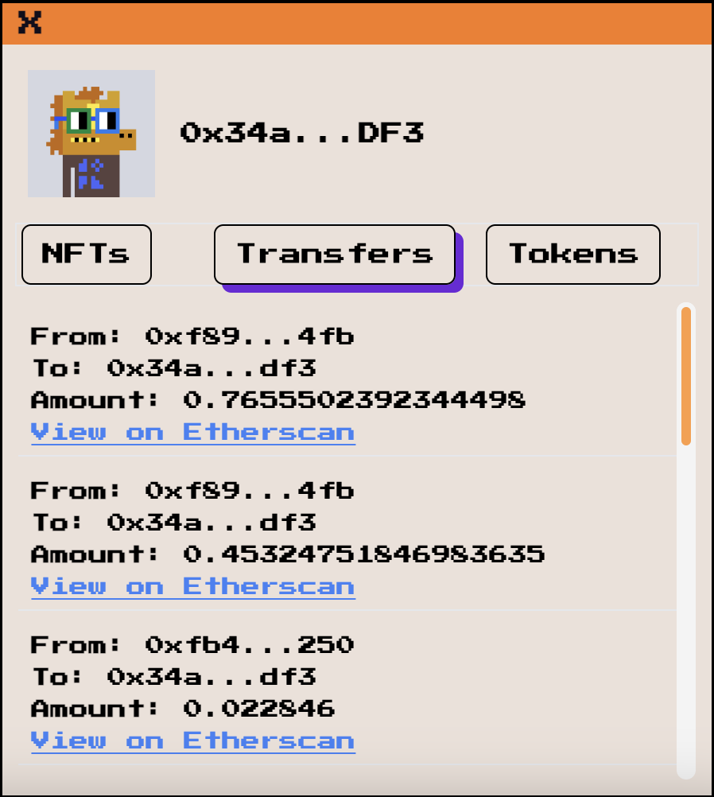
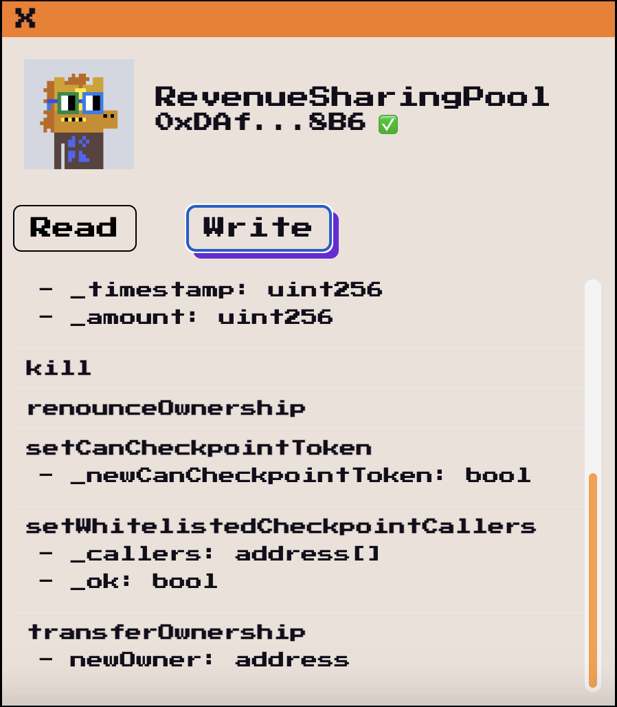

<!-- LOGO -->
<br />
<h1>
<p align="center">
  
  <br>HoverChain 🛸
</h1>
  <p align="center">
    HoverChain is your window into Ethereum.  Simply select an address, choose a chain, and dive into the data without ever opening a new tab.
    <br />
    </p>
</p>
<p align="center">
  <a href="#about-the-project">About The Project</a> •
  <a href="#stack">Stack</a> •
  <a href="#creating-blocks">Installation</a> •
  <a href="#credits">Credits</a>
</p>

## About The Project
This Chrome extension brings insights into Ethereum addresses on webpages, showing wallet balances, transactions, and smart contract methods on hover. Ideal for crypto enthusiasts or beginners seeking deeper insight without navigating away from their current page.

<p align="center">



</p>

## Stack

Name                          |  Usage
----------------------------------|------------------------------------------------------------------------------------
Alchemy            |  Primary Web3 API for fetching blockchain data.
Mantle API      |  Secondary Web3 API for fetching blockchain data.
React               |  Used for building the extension's popup and hover-over UI components.
Vite                |  For bundling the extension's codebase and managing dependencies.
Twind           |  For styling the extension's interface ensuring a smooth user experience.
TypeScript          |  Ensures type safety across the extension's codebase, improving maintainability.

## Installation
HoverChain is an Open Source Chrome Extension. You can load the unpacked code directly into your browser to test it out.

- Step 1: Clone the repository
```bash
git clone https://github.com/jackburrus/hoverchain
```
- Step 2: Install dependencies
```bash
pnpm install
```
- Step 3: Build the extension
```bash
pnpm dev # for development
pnpm build # for production
```
- Step 4: Load the extension into Chrome
  - Open Chrome and navigate to `chrome://extensions/`
  - Enable Developer Mode
  - Click `Load Unpacked` and select the `dist` folder in the project directory
- Step 5: Test the extension
  - Add your Alchemy API key in the extension toolbar popup.
  - Navigate to a webpage with an Ethereum address
  - Select the address to see the HoverChain extension in action


## Credits
- Created by Jack Burrus

[](https://github.com/jackburrus)
[](https://twitter.com/jackburrus)
[](https://www.linkedin.com/in/jamesburrus/)